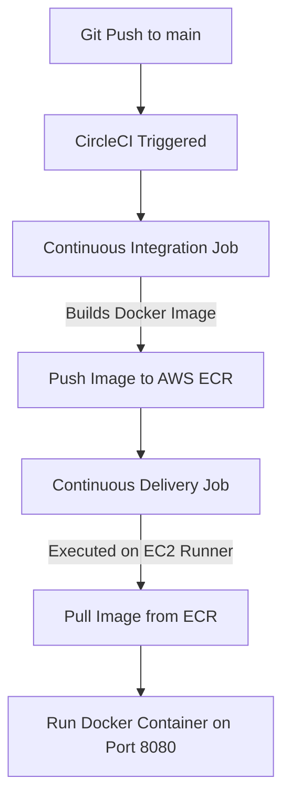

# End-to-end-NLP-Project-Implementation


## Project Workflows

- constants
- config_enity
- artifact_enity
- components
- pipeline
- app.py


## How to run?

```bash
conda create -n hate python=3.8 -y
```

```bash
conda activate hate
```

```bash
pip install -r requirements.txt
```

```bash
python app.py
```


# Gcloud cli
https://dl.google.com/dl/cloudsdk/channels/rapid/GoogleCloudSDKInstaller.exe

```bash
gcloud init
```


## CircleCI Deployment on AWS (Setup & Steps)

This project is configured to build and deploy automatically using CircleCI and AWS services (EC2, ECR, S3). 

### Setup Prerequisites & Configuration

#### 1. AWS IAM User Setup
Create an IAM User in your AWS account with programmatic access. Attach the following policies (or equivalent permissions):
* `AmazonEC2ContainerRegistryFullAccess` (to build and push/pull Docker images to ECR)
* `AmazonS3FullAccess` (to upload/download model files and datasets)

#### 2. AWS ECR Repository
Create a private ECR repository in your preferred region (e.g., `ap-south-1`):
* **Repository Name:** `hate-speech-classification`
* Note your Repository URI (e.g., `844099234694.dkr.ecr.ap-south-1.amazonaws.com/hate-speech-classification`).

#### 3. AWS S3 Bucket
Create an S3 bucket to persist the model artifacts and datasets:
* **Bucket Name:** `hate-speech-classification-844099234694` (must be globally unique, defined in [constants/__init__.py](file:///c:/Users/shikh/Downloads/code/gitHub/MLOpsLearning/nlp-project/hate/constants/__init__.py))
* **Region:** `ap-south-1`

#### 4. CircleCI Project Settings
Navigate to your CircleCI project settings and configure the following Environment Variables:
* `AWS_ACCESS_KEY_ID`: IAM user access key
* `AWS_SECRET_ACCESS_KEY`: IAM user secret key
* `AWS_REGION`: `ap-south-1`
* `AWS_ECR_REGISTRY_ID`: Your AWS Account ID (e.g., `844099234694`)

---

### Step-by-Step Deployment Architecture

Our deployment pipeline is defined in [.circleci/config.yml](file:///c:/Users/shikh/Downloads/code/gitHub/MLOpsLearning/nlp-project/.circleci/config.yml) and consists of two stages:



#### Step 1: Continuous Integration (Hosted Environment)
1. Triggered automatically on git push.
2. Checks out the code repository.
3. Sets up a remote Docker environment (`setup_remote_docker`).
4. Uses `Dockerfile` (configured with `python:3.8-slim-bullseye` to prevent EOL repository issues) to build the hate speech classifier application image.
5. Authenticates with AWS and pushes the built image tagged as `latest` to your private ECR repository.

#### Step 2: Continuous Delivery (Self-Hosted Runner on EC2)
1. Installs a **CircleCI Machine Runner** on a target EC2 instance (`t2.large` or similar) under the resource class namespace `shikhars22/deployments`.
2. The Runner is added to the `docker` group on the host OS so it can run Docker tasks without `sudo`.
3. Runs the delivery job directly on the EC2 host shell (`machine: true` executor):
   * Authenticates with AWS ECR.
   * Pulls the latest Docker image from ECR.
   * Stops and removes the existing `nlp-app` container if it is running.
   * Runs the new image mapping port `8080:8080` on the EC2 host.
   * Prunes unused images to save disk space.

---

### Run & Verify the Application

Once CircleCI completes the deployment successfully:

#### 1. Train the Model
The containerized application does not ship with a pre-trained model. You must trigger a training run:
* Open your browser and navigate to: `http://<YOUR-EC2-PUBLIC-IP>:8080/train`
* This runs the training pipeline inside the container.
* **S3 Fallback:** If you haven't created the S3 bucket yet, the pipeline automatically falls back to using the local `data/dataset.zip` file, trains the model, saves it inside local artifacts, and gracefully copies it to `artifacts/PredictModel/model.h5`.
* Once training completes, the browser will display **`Training successful !!`**.

#### 2. Execute Predictions
* Open the FastAPI interactive docs: `http://<YOUR-EC2-PUBLIC-IP>:8080/docs`
* Go to the `POST /predict` route, click **Try it out**, enter your text, and click **Execute**.
* The server will load the trained model and output the classification prediction (`hate and abusive` or `no hate`).

